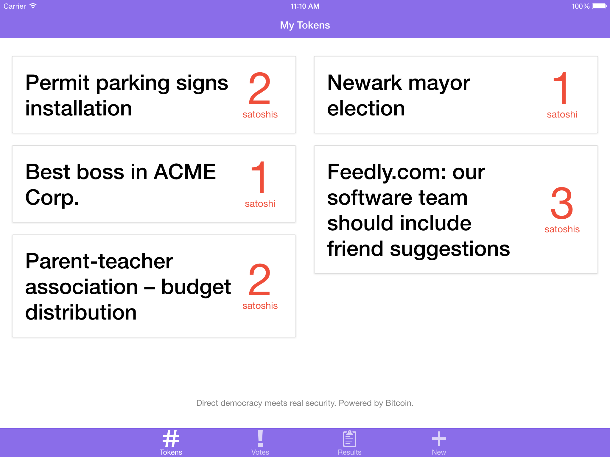
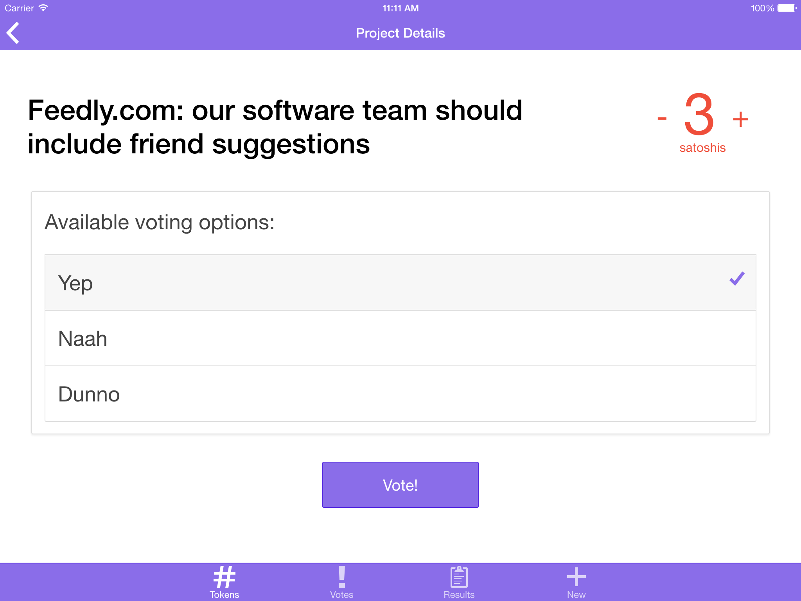
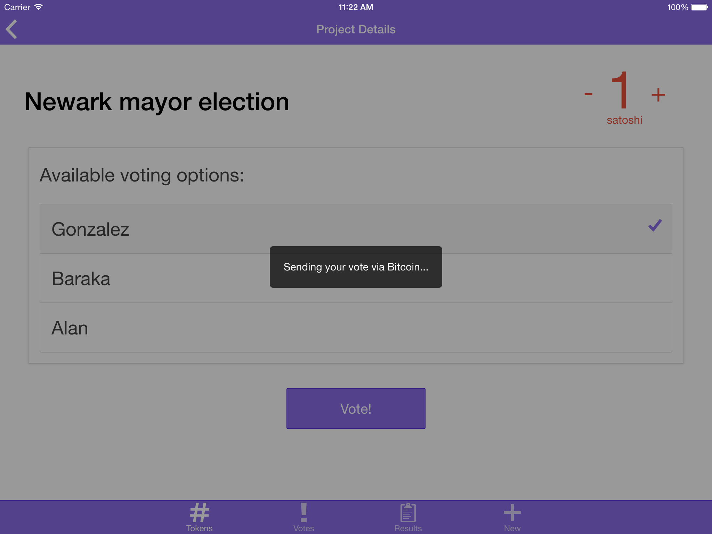

# Bitocracy

Bitocracy mates the direct democracy with the security model proven one of the most robust in the world - the on of the Bitcoin. It uses the smallest possible coin derived from Bitcoin - a Satoshi as a means of secure voters authentication, vote information transport and vote confirmation.

Bitcoin functionality is powered by Mashape's (via the SendTo APIs for sending bitcoins). App is built with Ionic framework and works across all major mobile platforms. Project is intended for social good and is fully open-source.

